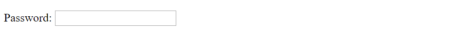
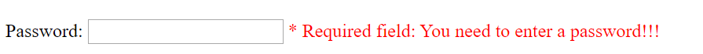
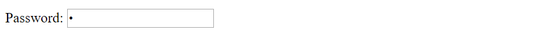

# Savvy Coders - Student Question: What event when?

## Overview

*"What would you use **'focus'** event for?"* was an excellent question and hilariously led me to guiding the student to writing an accidental infinite UI loop. So I thought I would create some quick examples code for some common events I've seen used.

## What Events?

MDN has a list of events [here](https://developer.mozilla.org/en-US/docs/Web/Events), let's go over some common ones seen in the wild.

| Event Name  | Fired When  |
|---|---|
| focus | An element has received focus (does not bubble). |
| blur |  An element has lost focus (does not bubble). |
| click | A pointing device button (ANY button; soon to be primary button only) has been pressed and released on an element |

## When Should we use them?

***"click"*** is probably the most commonly used event, but before we get to that, lets quickly go over the question *"What would you use **'focus'** for?"*

A good example for ***'focus'*** *(or more appropriately **'blur'**)* would be a form where the user is expected to enter a required value first, or before the user moves out of an entry field like a text box. "Password" and/or "Username" fields are good examples. When creating a new account or logging in, these cannot be left blank.


```javascript
//generic functions
//create an alert event callback
function alertOnEventHandler(event){
  alert(`alert event triggered: ${event}`);
}
//create a log event callback
function logOnEventHandler(event){
  console.log(`log event triggered : ${event}`);
}
//show warning label callback
function showWarningWhenEmptyHandler(event){
  //the warning label is the next sibling ion our html
  const warning = event.target.nextElementSibling;
  //for practice, let's check to make sure it's of the 'warning' class
  if(warning.class = "warning"){
    warning.style.visibility =  !event.target.value ? "visible" : "hidden";
  }
}
```

```html
      <label>Password:</label>
      <input type="password" id="user-pwd" onfocus="showWarningWhenEmptyHandler(event)">
      <label id="user-password-warning" class="warning">* Required field: You need to enter a password!!!</label><br><br>
```
When the form loads, the password field looks like this:


With the preceding code, the user sees a string of red text, see below, after entering (clicking on) the empty input box.



Clicking on an element in the page puts the item in 'focus', clicking off is removing the element from focus or *'blur'*-ing the element.

If the user enters some data, leaves and then re-enters, the warning is hidden with the ternary operator code here:

```javascript
// question mark "?" is called a ternary operator, and is shorthand for simple if statements. let <some variable> = <conditional> ? <result returned if true> : <result returned if false>
warning.style.visibility =  !event.target.value ? "visible" : "hidden";
```

this is the exact same as saying:

```javascript
//not (!), or inverse of: falsey if the string is empty, true if the string has data
//  e.g. the 'if' evaluates to "true" if there is nothing in the password box
if(!event.target.value){
  //set the warning text to "visible" because the required field is empty
  warning.style.visibility = "visible";
} else {
  //set the warning text to "hidden" because the required field is empty
  warning.style.visibility = "hidden";
}

```

Resulting in the following:


What we really want is to show the text after the user clicks off the input *iff* they didn't enter the correct/any input and then leave the input box.  To do this, we use **'blur'**. (Note: *'iff'* is not a typo, it stands for "if and only if" )

```html
      <label>Password:</label>
      <input type="password" id="user-pwd" onblur="showWarningWhenEmptyHandler(event)">
      <label id="user-password-warning" class="warning">* Required field: You need to enter a password!!!</label><br><br>
```



Above shows no warning when the user enters the text box, or after leaving, if there is data when using ***'blur'*** *(onblur)* event.

Below


Confused yet? Play with the code by changing "onfocus" to "onblur" and back for the different inputs in the index.html file.
```html
//change the event from onblur to onfocus
//initial code:
<input type="password" id="user-pwd" onblur="showWarningWhenEmptyHandler(event)">
//changed:
<input type="password" id="user-pwd" onfocus="showWarningWhenEmptyHandler(event)">
```

Then change the event handlers being called
```html
//change the function for the events
//initial code:
<input type="password" id="user-pwd" onblur="showWarningWhenEmptyHandler(event)">
//changed:
<input type="password" id="user-pwd" onblur="logOnEventHandler(event)">
//and changed again:
<input type="password" id="user-pwd" onblur="alertOnEventHandler(event)">

//change both
<input type="password" id="user-pwd" onfocus="logOnEventHandler(event)">
//
<input type="password" id="user-pwd" onfocus="alertOnEventHandler(event)">

```

Did you see some strange behavior? What happens if you use both ***'onblur'*** and ***'onfocus'***?

##  The "Infinite" UI loop bug

If you set ***'onfocus'*** to
```javascript
onfocus="alertOnEventHandler(event)"
```
then click on the element with that event handler, you'll probably see the alert continuously pop up. Can you guess why this is happening? Does the same thing happen if you change the 'onfocus' to 'onblur'? Pause for a moment before reading further.

**SQUIRREL!!!!**


Ok hopefull that image of the squirrel was enough to distract you from reading the answer.

Answer: So if you create an alert in the **'focus'** event, when you go to click the alert popup to close it, you are going through the following event loop.

1) giving focus to the input element that calls the 'focus' event that creates the alert

2) the focus method is called and an alert is created

3) the alert gets focus, the original calling element gets blurred

4) when the "OK" button is clicked, the popup is closed and default focus goes back to the last element that had focus

5) the last element to have focus was the elment with the callback that creates the alert and the whole thing starts over, back to step #1

Not thinking, I instructed a student to write this code and it took a minute to figure out what had happened. The lesson being, sometimes it's not a good idea to simply swap console.log with alert. :)
